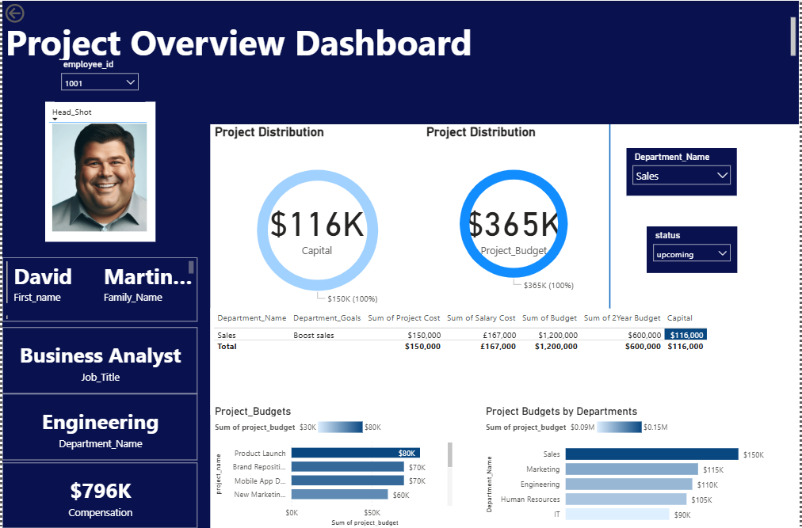

# Workforce Budget Risk & Performance Dashboard

## 📌 Project Overview
This project analyses departmental budgets and project performance to identify:
- Departments or projects at risk of being **over budget**
- Underperforming projects based on cost and workforce allocation
- Whether **annual expenses can be covered within a 2-year budget cycle**

The solution is built using **SQL for data preparation** and **Power BI for interactive dashboards**.

---

## 🎯 Business Problem
Organizations set department budgets at **2-year intervals**, but lack visibility on:
- Budget overruns
- Salary cost impact
- Project-level financial risk

This dashboard helps management take **early corrective actions**.

---

## 🗂 Data Sources
- Employee information
- Salary data
- Department budgets
- Project details

*(Sample / anonymised data used)*

---

## 🛠 Tools & Technologies
- **Power BI** – Dashboard & visualisation
- **SQL** – Data cleaning and aggregation
- **Excel / CSV** – Source data

---

## 📊 Key Dashboard Insights
- Departments exceeding allocated budgets
- Salary distribution by department
- Project cost vs budget comparison
- Risk indicators for underperforming projects

---

## Dashboard Preview

---

